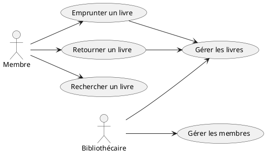
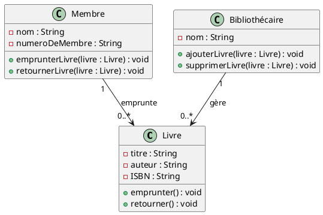
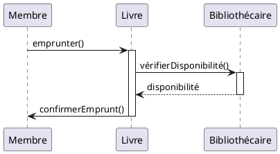
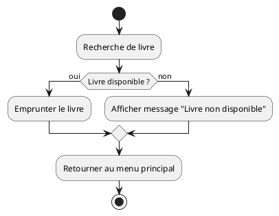
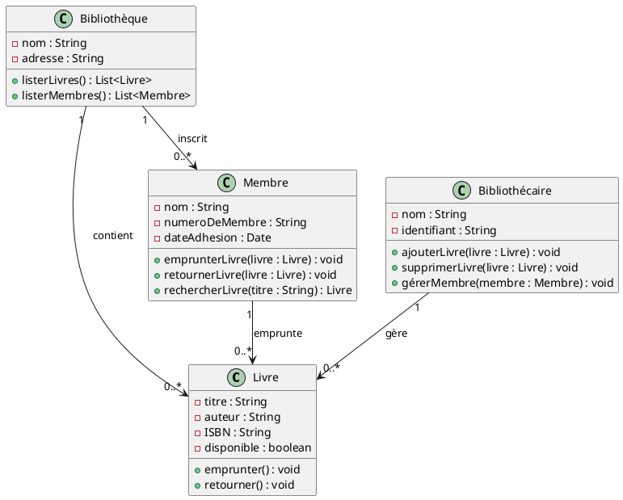

UML, ou Unified Modeling Language, est un langage de modélisation standardisé utilisé en ingénierie logicielle pour spécifier, visualiser, construire et documenter les systèmes informatiques. Il permet de créer des diagrammes qui représentent différentes aspects d'un système, tels que sa structure, son comportement et ses interactions. 

Les types de diagrammes UML incluent :

1. **Diagrammes de cas d'utilisation** : montrent les interactions entre les utilisateurs (acteurs) et le système.
2. **Diagrammes de classes** : représentent les classes et leurs relations dans le système.
3. **Diagrammes de séquence** : illustrent comment les objets interagissent dans un certain ordre dans le temps.
4. **Diagrammes d'activités** : décrivent le flux de travail ou d'activités dans un processus.

UML est largement utilisé dans le développement de logiciels orientés objet et aide à faciliter la communication entre les parties prenantes tout au long du cycle de vie d'un projet.

La structure de base d'un document UML doit être claire et bien organisée pour faciliter la compréhension des modèles et des diagrammes. Voici les éléments typiques que l'on retrouve dans un document UML :

1. **Page de Garde** :
   - Titre du document
   - Nom du projet
   - Auteurs
   - Date

2. **Table des Matières** :
   - Liste des sections et des diagrammes inclus dans le document avec leur page respective.

3. **Introduction** :
   - Contexte du projet
   - Objectif du document
   - Portée et limites

4. **Description Générale** :
   - Vue d'ensemble du système
   - Public cible
   - Technologies utilisées

5. **Diagrammes UML** :
   - **Diagrammes de cas d'utilisation** : Présentation des cas d'utilisation avec des descriptions.
   - **Diagrammes de classes** : Détails des classes, leurs attributs et méthodes, et leurs relations.
   - **Diagrammes de séquence** : Description des interactions entre objets dans différents scénarios.
   - **Diagrammes d'activités** : Représentation des workflows et des processus.

6. **Détails des Diagrammes** :
   - Description et explication de chaque diagramme, y compris les éléments clés et leur signification.

7. **Annexes** :
   - Informations supplémentaires, glossaire des termes et abréviations.

8. **Références** :
   - Documents et sources utilisés pour créer le document UML.

Chaque section du document doit être clairement indiquée, et les diagrammes doivent être accompagnés de légendes et de descriptions pour aider les lecteurs à comprendre les concepts qu'ils représentent. Une bonne documentation UML peut grandement faciliter le développement et la maintenance des systèmes logiciels.

Voici un exemple simplifié de ce à quoi pourrait ressembler un document UML pour un projet fictif de gestion d'une bibliothèque. Cet exemple est une version résumée, et chaque section pourrait être développée davantage selon les besoins du projet.

---

### Document UML pour le Projet de Gestion de Bibliothèque

#### Page de Garde
- **Titre** : Document UML - Système de Gestion de Bibliothèque
- **Nom du Projet** : Bibliothèque 2023
- **Auteurs** : Jean Dupont, Marie Lefevre
- **Date** : 15 octobre 2023

#### Table des Matières
1. Introduction
2. Description Générale
3. Diagrammes UML
   - 3.1 Diagramme de Cas d'Utilisation
   - 3.2 Diagramme de Classes
   - 3.3 Diagramme de Séquence
   - 3.4 Diagramme d'Activités
4. Détails des Diagrammes
5. Annexes
6. Références

#### 1. Introduction
Ce document présente les modèles UML pour le système de gestion de bibliothèque. Il a pour objectif de définir la structure du système, les interactions entre ses composants, ainsi que le comportement des utilisateurs avec le système.

#### 2. Description Générale
Le système de gestion de bibliothèque permet aux utilisateurs de prêter, retourner et rechercher des livres. Il est destiné aux bibliothécaires et aux membres de la bibliothèque.

#### 3. Diagrammes UML

##### 3.1 Diagramme de Cas d'Utilisation
  
*Dans le diagramme, les acteurs clés incluent le « Bibliothécaire » et le « Membre ». Les cas d'utilisation principaux incluent « Emprunter un livre », « Retourner un livre » et « Rechercher un livre ».*

##### 3.2 Diagramme de Classes
  
*Classes principales : Livre, Membre, Bibliothécaire. Les relations incluent l'héritage et l'association.*

##### 3.3 Diagramme de Séquence
  
*Ce diagramme montre la séquence d'interaction entre le membre et le système lors de l'emprunt d'un livre.*

##### 3.4 Diagramme d'Activités
  
*Le diagramme illustre le processus d'emprunt d'un livre, depuis la recherche jusqu'à la confirmation de l'emprunt.*

#### 4. Détails des Diagrammes
- **Diagramme de Cas d'Utilisation** :
  - **Emprunter un livre** : Interaction entre le membre et le système.
  - **Retourner un livre** : Processus de retour géré par le bibliothécaire.
- **Diagramme de Classes** :
  - **Livre** : Attributs : titre, auteur, ISBN.
  - **Membre** : Attributs : nom, numéro de membre, contact.
- **Diagramme de Séquence** :
  - Les messages échangés entre les objets lors de l'emprunt d'un livre.
- **Diagramme d'Activités** :
  - Flux d'activités depuis la recherche jusqu'à l'emprunt.

#### 5. Annexes
- Glossaire des termes utilisés : 
  - **Membre** : un utilisateur inscrit dans la bibliothèque.
  - **Bibliothécaire** : un employé qui gère les opérations de la bibliothèque.

#### 6. Références
- Manuel de l'utilisateur pour le système de gestion de bibliothèque.
- Spécifications de projet.

---

Ce modèle de document UML peut être adapté à divers projets en fonction de leur complexité et des niveaux de détails requis. Les diagrammes peuvent être créés à l'aide d'outils comme Lucidchart, Draw.io, ou des outils de modélisation UML spécifiques.

Voici un exemple de code PlantUML qui illustre comment créer différents types de diagrammes UML, comme un diagramme de cas d'utilisation et un diagramme de classes. PlantUML est un outil très pratique pour créer facilement des diagrammes à partir de texte.

### Exemple de Diagramme de Cas d'Utilisation

### Exemple de Diagramme de Classes

### Exemple de Diagramme de Séquence

### Exemple de Diagramme d'Activités

Pour générer ces diagrammes, il vous suffit de copier le code PlantUML et de le coller dans un éditeur compatible avec PlantUML, comme [PlantText](https://www.planttext.com/) ou tout autre outil qui prend en charge le rendu de PlantUML. Ces diagrammes aident à visualiser la structure et le comportement du système que vous modélisez.

Voici un exemple de code PlantUML pour un diagramme de classes qui modélise un système de gestion de bibliothèque. Ce diagramme inclut les classes principales avec leurs attributs, méthodes et relations.

### Diagramme de Classes

### Description du Diagramme

- **Classes** :
  - **Livre** : Représente un livre avec des attributs comme le titre, l'auteur, l'ISBN et un indicateur de disponibilité. Elle a des méthodes pour emprunter et retourner un livre.
  - **Membre** : Représente un membre de la bibliothèque avec son nom, son numéro de membre et la date d'adhésion. Elle a des méthodes pour emprunter, retourner et rechercher des livres.
  - **Bibliothécaire** : Représente le bibliothécaire qui peut ajouter ou supprimer des livres et gérer les membres.
  - **Bibliothèque** : Représente la bibliothèque elle-même et contient des méthodes pour lister les livres et les membres.

- **Relations** :
  - Un **Membre** peut emprunter plusieurs **Livres**.
  - Un **Bibliothécaire** gère plusieurs **Livres**.
  - Une **Bibliothèque** contient plusieurs **Livres** et est inscrite par plusieurs **Membres**.

Pour visualiser ce diagramme, vous pouvez copier ce code PlantUML dans un éditeur compatible, comme [PlantText](https://www.planttext.com/) ou d'autres outils de modélisation UML.

